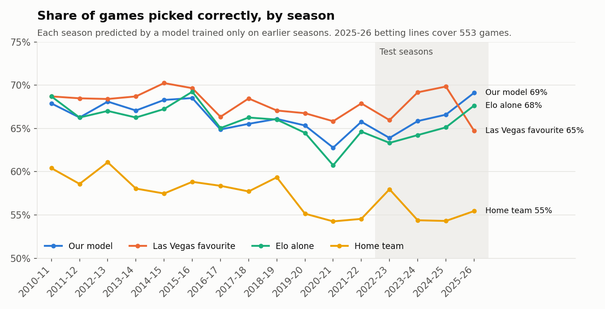
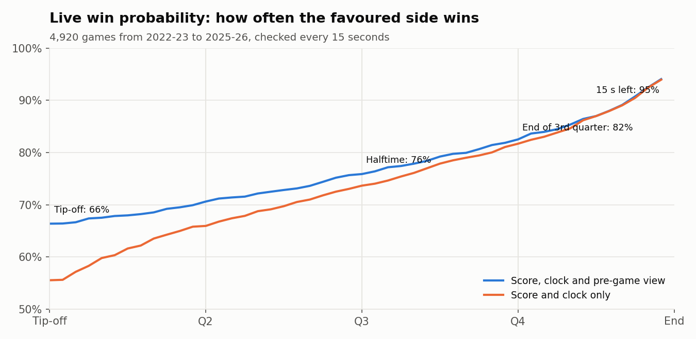
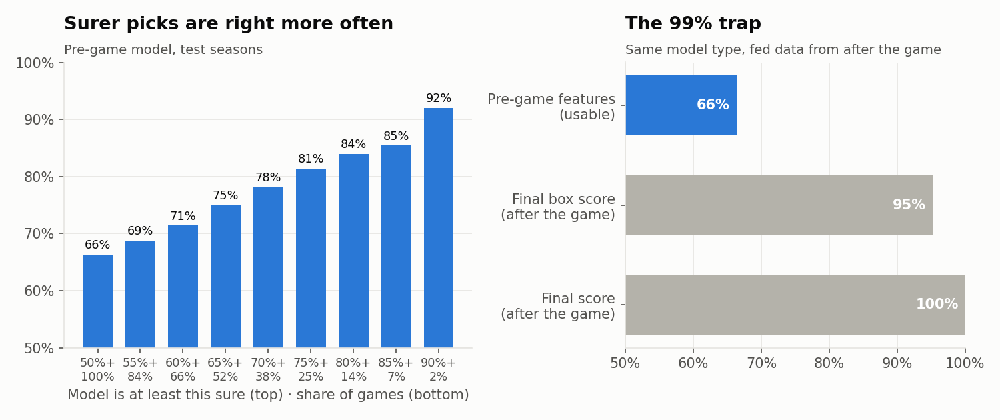

# NBA Game Predictor

**Pre-game winner picks and live win probability for NBA games, built on 35,527 games of play-by-play data and published on Microsoft Fabric**
Python · scikit-learn · Elo ratings · MLflow · Microsoft Fabric (Lakehouse, notebooks, Direct Lake, Power BI)



## Results

Every number below comes from the four most recent seasons, **2022-23 to 2025-26 (4,920 games)**. Each season is predicted by a model trained only on earlier seasons, so these numbers show how the model would have done in real time.

| Pre-game picks | Accuracy | Log loss |
|---|---|---|
| **Our model** | **66.4%** | 0.613 |
| Elo ratings alone | 65.1% | 0.628 |
| Always pick the home team | 55.5% | 0.693 |
| *Games with betting lines (4,169):* our model | 65.5% | 0.621 |
| *Games with betting lines (4,169):* Las Vegas favourite (closing moneyline) | 67.8% | 0.598 |

- **Within about 2 points of the betting market.** The market also knows about injuries and rest decisions, which this model doesn't see. The two pick the same winner in 85% of games.
- **Confidence means something.** When the model is at least 80% sure, it's right **84%** of the time (14% of games). At 90% or more, it's right **92%** (2% of games). Its probabilities are well calibrated: when it gives the home team 70–80%, the home team wins 75% of the time.

| Live win probability | Picks the winner |
|---|---|
| Tip-off | 66.5% |
| End of 1st quarter | 70.4% |
| Halftime | 76.0% |
| End of 3rd quarter | 82.2% |
| 5 minutes left | 87.6% |
| 2 minutes left | 91.7% |
| 1 minute left | 93.4% |
| 15 seconds left | 95.1% |



The pre-game view matters most early. At tip-off it adds 11 points over score-and-clock alone (66.5% vs 55.5%), and by the fourth quarter the score says it all.

## Why not 99%?

No honest pre-game model gets close to 99%. The best ones, the betting market included, pick about two-thirds of NBA winners, because upsets happen. A model that reports 99% has almost always seen information from after the game. The project shows this directly. Fed the **final box score** (shooting, rebounds, turnovers), the same kind of model scores **95%**, and fed the **final score** it scores **100%**. Neither can be used to predict anything.



## Data

- **Play-by-play and shot charts** for every regular-season game from 1996-97 to 2025-26 (stats.nba.com), from [shufinskiy/nba_data](https://github.com/shufinskiy/nba_data). From these come final scores, a scoring timeline for every game (4.1 million scoring plays) and dates.
- **Closing betting lines** (moneyline and spread) for 2007-08 to 2025-26, from the Sportsbook Review archive in [kyleskom/NBA-Machine-Learning-Sports-Betting](https://github.com/kyleskom/NBA-Machine-Learning-Sports-Betting). Lines are matched to 96.7% of games. Final margins agree with our play-by-play scores in 99.4% of matched games. The 2025-26 lines cover the first 553 games only.
- Both sources are pinned to a commit, and every file is checked against a SHA-256 checksum (`src/checksums.json`).

## Approach

| Step | Script | What it does |
|---|---|---|
| 0 | `src/00_download.py` | Download the raw files (about 300 MB) and verify their checksums |
| 1 | `src/01_parse_pbp.py` | Parse 30 seasons of play-by-play into games, scoring timelines and team box scores |
| 2 | `src/02_features.py` | Pre-game features: Elo ratings (FiveThirtyEight's NBA method), rest days and back-to-backs, season and last-10 point differential, the league-wide home-court edge over the past year. Betting lines are matched for benchmarking only. |
| 3 | `src/03_pregame_model.py` | Logistic regression vs. gradient boosting, chosen on 2020-21 and 2021-22. Walk-forward predictions for every season since 2010-11, the betting-market benchmark, confidence and calibration tables, and the leakage demonstration. |
| 4 | `src/04_live_model.py` | Live model: every game sampled every 15 seconds (3.7 million snapshots). Logistic regression on the lead measured against the time left, plus the pre-game view, whose weight fades as the game goes on. Fit on 2010-11 to 2021-22. |
| 5 | `src/05_export.py` | Report tables for the Lakehouse |
| 6 | `src/06_figures.py` | The charts in this README |
| 7 | `src/07_upcoming.py` | 2026-27 picks: today's schedule and results from ESPN, the same features rebuilt game by game, scored by the registered model (runs daily in Fabric) |

**On Microsoft Fabric** (`fabric/`):

- `NBA_Game_Predictor.ipynb` runs steps 0–5 in Fabric in about 7 minutes on a starter pool. It registers both models with MLflow (`nba-pregame-winner`, `nba-live-win-probability`), saves nine Delta tables to the `NBA_Lakehouse` Lakehouse and copies the result tables to `Files/nba/`. The notebook is generated from `src/` by `fabric/build_notebooks.py`, so Fabric runs exactly the code in this repository, and it reproduces the local results to the last decimal.
- `NBA_Upcoming_Picks.ipynb` runs every morning on a Fabric schedule. It pulls the 2026-27 schedule and results from ESPN's public scoreboard, carries each team's Elo rating forward from 2025-26, rebuilds the step 2 features one game at a time from finished games only (a replay of 2025-26 reproduces step 2's features exactly), and scores every game with the registered model. Played games are graded and the next two weeks get a pick (`season_picks` table). Code: `src/07_upcoming.py`.
- `NBA_Report_Builder.ipynb` builds a Direct Lake semantic model (a relationship, 13 DAX measures, percent formats) and a four-page Power BI report from Python, using semantic-link-labs. Pages: 2026-27 picks (record so far, upcoming picks, results), pre-game picks, live win probability (pick a season, team and game), and games and teams.
- The report is published as the **NBA Game Predictor** Fabric app ([open the app](https://app.fabric.microsoft.com/Redirect?action=OpenApp&appId=6e566047-8066-40cf-86ae-0be3215a2d89&ctid=83b30141-8b54-49f4-be83-e9f1da22bc6c); viewers need access granted in the app's audience settings).

## How to run locally

```bash
pip install -r requirements.txt
python run_all.py          # about 10 minutes; downloads the data on the first run
```

## Limitations

- No injury or lineup data. That is most of the gap to the betting market.
- The live model knows the score and the clock, not who has the ball or how many timeouts are left. Late-game possession is the main reason it tops out around 95% with 15 seconds left.
- Regular season only. Playoff games behave differently (smaller home edge, tighter rotations).

---

**Emmanuel Jibiri**, Data Analyst, Houston, TX · [LinkedIn](https://www.linkedin.com/in/ejibiri/) · [Portfolio](https://emmanueljibiri.com/)
